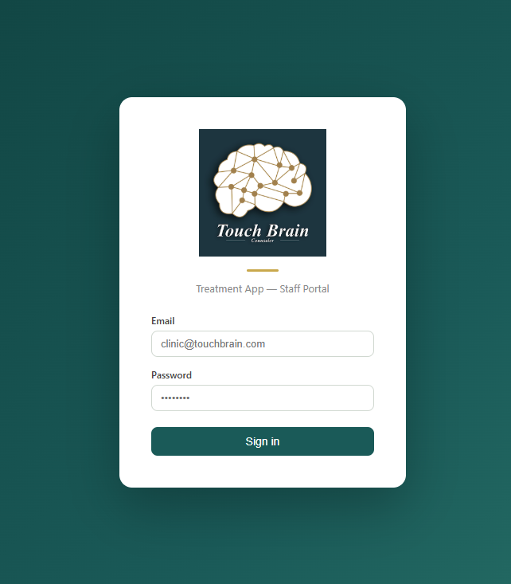
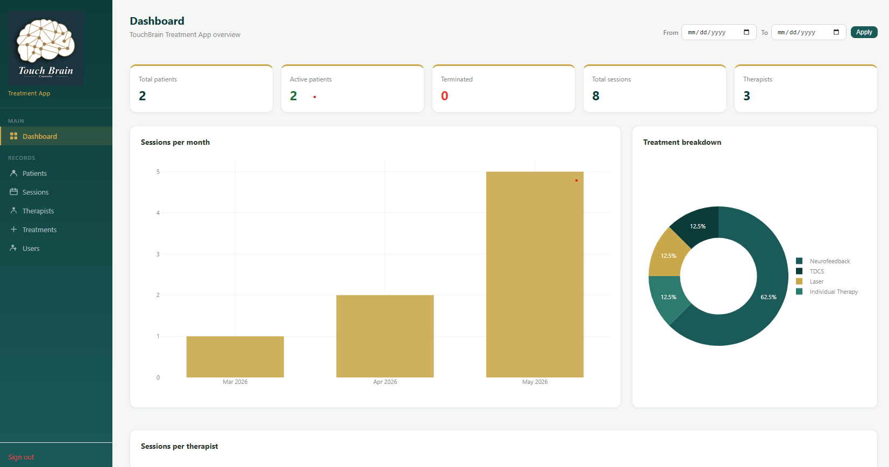
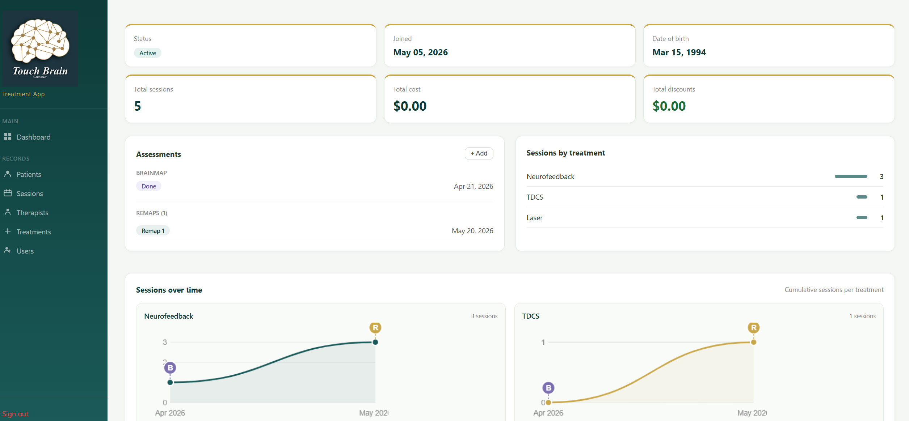

# TouchBrain Treatment App

A full-stack clinic management system built with Python/Flask for 
TouchBrain Counseling Clinic in Coquitlam, BC.

## Screenshots
### Login Page

### Main Dashboard

### Patient Profile

## Database Design

Schema built from scratch to reflect real clinic operations:

- **Many-to-many** sessions ↔ therapists via junction table
- **Treatment** stored as a dimension table for consistent grouping in reports
- **Assessments** (brainmap/remap dates) in a separate table — enabling timeline markers on charts
- **Cost normalization** across session, cost, and cost_category tables

## Dashboard & Analytics

- Sessions per month (bar chart) with date range filter
- Treatment breakdown by type (donut chart)
- Per-patient treatment timeline with brainmap (B) and remap (R) markers overlaid

  

## Tech Stack
- Backend: Python, Flask, SQLAlchemy, Flask-JWT-Extended
- Database: PostgreSQL (Supabase)
- Frontend: Jinja2, HTML/CSS/JavaScript, Plotly
- Deployment: Render

## Features
- Patient management with profile pages and treatment history
- Session tracking with multiple therapists and treatments
- Dashboard with session analytics and date filtering
- Role-based access control (Admin/Staff)
- Print patient profile
- Mobile responsive design

## Challenges Solved
- Many-to-many sessions ↔ therapists using SQLAlchemy junction table
- JWT authentication alongside Flask session-based auth for HTML pages
- Canvas-based patient charts with brainmap/remap markers built without charting libraries
- Supabase IPv6 connection resolved via pooler URL

## Security
- All credentials in environment variables — no secrets in repo
- Bcrypt password hashing, session timeout, route protection
- RLS enabled on all Supabase tables

